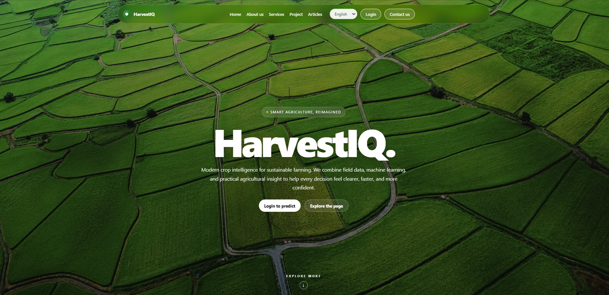
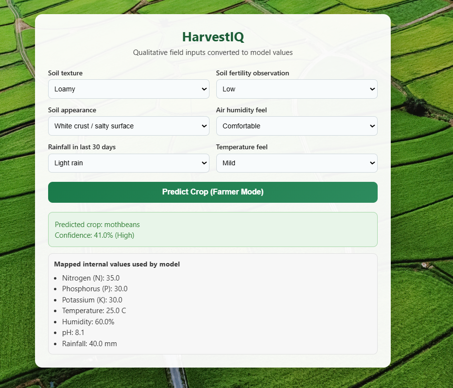
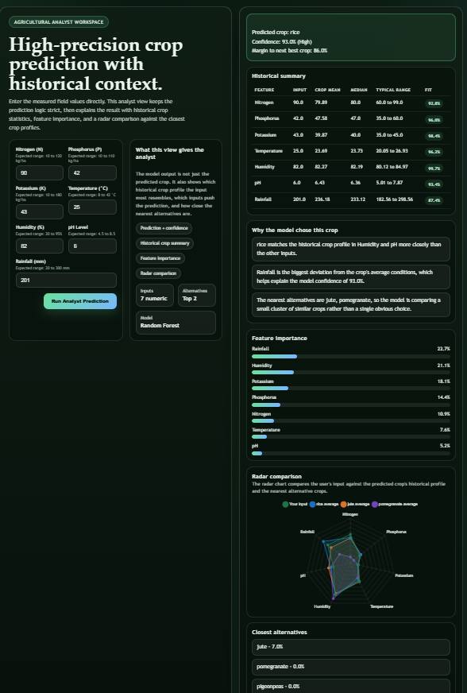
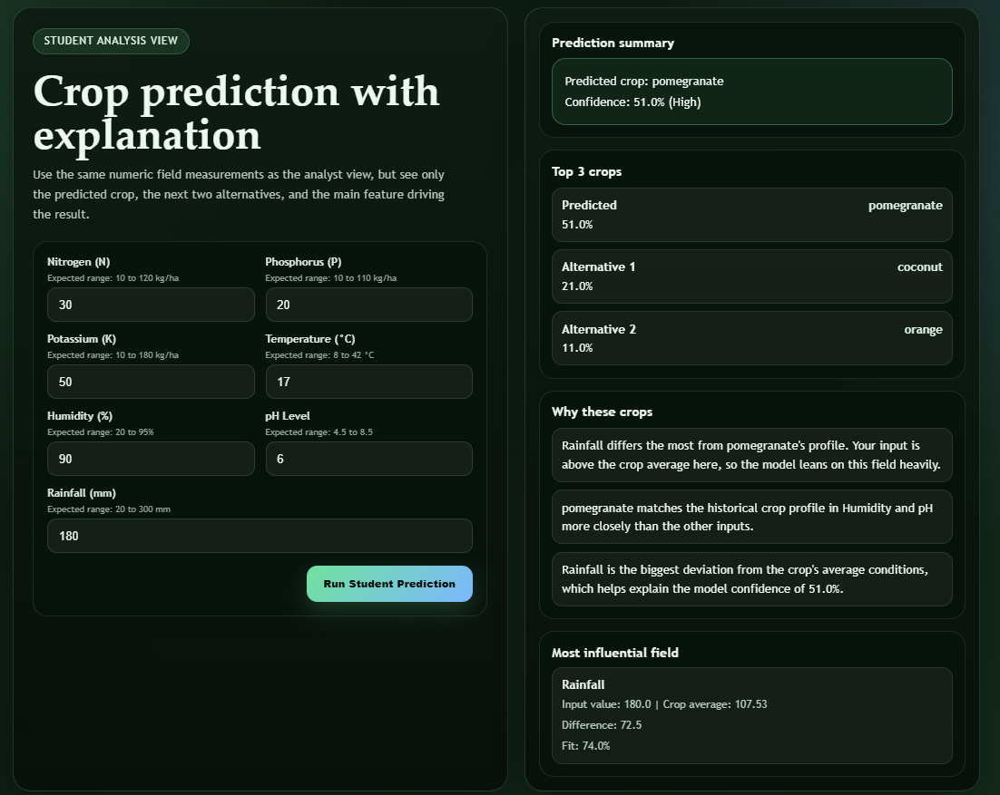

# HarvestIQ

HarvestIQ is a Flask-based smart crop recommendation system that helps farmers, agricultural analysts, and students get crop suggestions from soil and weather inputs. The app combines machine learning, role-based interfaces, MySQL-backed authentication, and multilingual support in a single web application.

## Features

- Crop recommendation powered by a trained `RandomForestClassifier`
- Three role-based prediction views:
  - Farmer view for simple qualitative inputs
  - Agricultural analyst view for numeric inputs, confidence, historical summaries, and radar comparison
  - Student view for simplified prediction output
- User registration, login, logout, and role selection
- MySQL-backed account storage
- English, Hindi, and Tamil UI support
- Responsive homepage with service, project, and article sections
- Local static assets and templated HTML pages

## Tech Stack

- Python
- Flask
- MySQL
- Pandas
- NumPy
- scikit-learn
- HTML, CSS, and JavaScript

## Main Entry Point

The primary application entry point is `main2.py`.

`main.py` is present in the folder, but `main2.py` is the active app used for the project.

## Project Structure

```text
HarvestIQ/
├── Crop_recommendation.csv
├── main2.py
├── main.py
├── model.py
├── crop_model.pkl
├── requirements.txt
├── README.md
├── templates/
│   ├── home.html
│   ├── login.html
│   ├── farmer_index.html
│   ├── analyst_index.html
│   ├── student_index.html
│   └── index.html
└── static/
    ├── Fonts/
    ├── bg.jpg
    ├── farmer.png
    ├── farmers.jpg
    ├── analyst.jpg
    ├── student.jpg
    ├── student_farm.jpg
    ├── tractor.png
    ├── Rectangle.jpg
    └── other image assets
```

## How It Works

1. The user opens the homepage and chooses a role.
2. The selected role opens a dedicated prediction form.
3. The app validates the inputs.
4. The trained model predicts the best crop.
5. The app renders a role-specific result page.



### Farmer View

- Uses qualitative inputs such as soil texture, soil fertility, soil appearance, humidity feel, rainfall pattern, and temperature feel.
- Converts those choices into numeric values before sending them to the model.



### Analyst View

- Accepts direct numeric inputs for N, P, K, temperature, humidity, pH, and rainfall.
- Shows the predicted crop, confidence, alternative crops, historical crop statistics, and feature importance.



### Student View

- Uses the same numeric inputs as the analyst view.
- Returns a simplified prediction summary with top crops and a short explanation.



## Requirements

Install the dependencies listed in `requirements.txt`.

## Setup

### 1. Create and activate a virtual environment

```bash
python -m venv .venv
.venv\Scripts\activate
```

### 2. Install dependencies

```bash
pip install -r requirements.txt
```

### 3. Configure MySQL

Set these environment variables before running the app:

```bash
set MYSQL_HOST=localhost
set MYSQL_PORT=3306
set MYSQL_USER=root
set MYSQL_PASSWORD=your_password
set MYSQL_DATABASE=agriflask
set MYSQL_USERS_TABLE=users
```

You can also place them in a local `.env` file.

## Run the Application

Start the web app with:

```bash
python main2.py
```

Then open:

```text
http://127.0.0.1:5000/
```

## Routes

- `/` - Home page
- `/set-language` - Change the UI language
- `/login` - Login and account management
- `/register` - Register a new account
- `/logout` - Log out
- `/go-predict` - Redirect to the correct prediction page based on role
- `/farmer-predictor` - Farmer prediction form
- `/farmer-predict` - Farmer prediction submission
- `/analyst-predictor` - Analyst prediction form
- `/analyst-predict` - Analyst prediction submission
- `/student-predictor` - Student prediction form
- `/student-predict` - Student prediction submission

## Model Training

If you want to retrain the crop model, run `model.py`. It uses `Crop_recommendation.csv` to train and save `crop_model.pkl`.

## Notes

- The app automatically creates the MySQL database and `users` table if they do not exist.
- The dataset column for temperature is named `temperature`, while the app maps it internally to `temp`.
- Static images and fonts are stored locally inside `static/`.
- The UI uses translation keys so the same templates can render in multiple languages.

## License

No license has been specified for this project.
